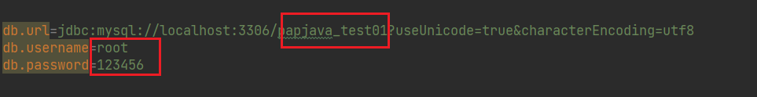

# PapJava
自动化生成CRUD及多模块代码框架（生成后的代码是以Mybatis框架为主的SpringBoot项目）

#### 使用方法：
###### 第一种情况：确保您的项目已经有基础项目配置（Spring启动配置，jdk配置（jdk1.8），application.properties的数据库配置）
那么：
建议将代码生成框架放在您项目的同级目录中运行，
然后在本框架中的application.properties 
中设置所有的代码生成的配置。
必须要自行配置的条目是：
1.数据库配置：

2.默认生成路径，建议改成您项目中的根目录路径

###### 第二种情况：没有事先进行任何配置
那么：
在本application.properties中相应配置设置生成
1.设置生成目录为与本代码生成项目的同级目录，这样的话就会使用和本项目一样的启动配置，但是您可能没有这些配置，
所以如何您先启动了这个代码生成项目，那么您离使用生成的项目也不远了
即：将以下目录改成与本项目的一样的同级目录

2.Spring运行启动程序

注意事项：
已存在的文件不会被覆盖，如果想生成代码，请先把同路径下的同名文件删除！
